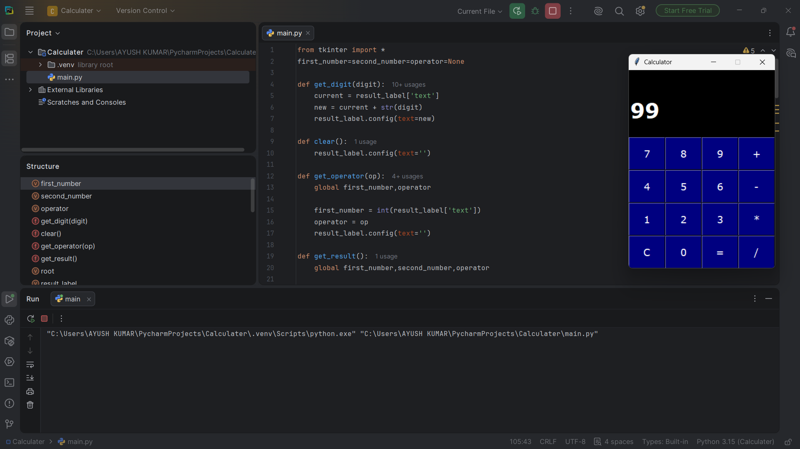

# Tkinter Calculator

A simple calculator application built using Python and Tkinter.

## 📸 Screenshot



---

## 🚀 Features

- Addition
- Subtraction
- Multiplication
- Division
- Error Handling
- Simple GUI Interface
- Dark Theme Design

---

## 🛠 Technologies Used

- Python
- Tkinter

---

## 📂 Project Structure

```text
Calculator/
│
├── main.py
├── screenshot.png
└── README.md
